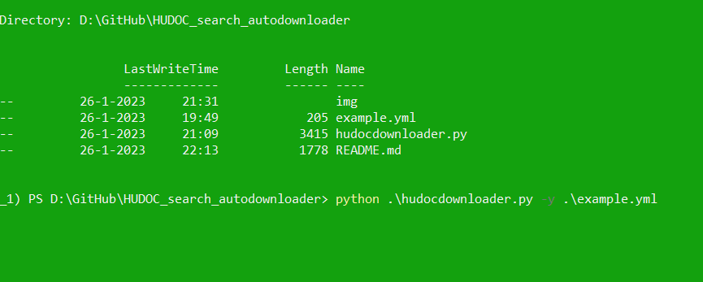

# HUDOC Downloader

The point of this program is to provide an easy way to download European Court of Human Rights cases of a search. You need to first search in HUDOC and then copy paste the search terms off the address bar. 

Put the search and complete the fields of the YAML file so that they look like this, modified to suit your your needs. 

Then run the scrip from your command line, with one single flag -y for the location of your yaml file.

The output of this notebook puts the cases in txt and html format in the directories specified in the yaml file. If they do not exist they are created. 

Automation uses selenium and chromedriver. Make sure you have a chromedriver version that is compatible with your chrome version. You can download chromedriver from [here](https://chromedriver.chromium.org/downloads).

You can find your version of chrome in Settings --> About Chrome.

## Objectives

The objective of this script is enable reproducible research. Automated downloading helps by ensuring that:
* Overcoming the time limitations that manual downloads involve.
* Overcomes legal barriers to web scraping which (however unreasonable) may exist in some places.
* Downloading off a search should enable the researcher to know how many of the cases the search finds where actually downloaded. The program reports failed downloads.
* Be useful for qualitative researchers that need a smaller number of cases and ease of use.

### TODO

* add flag to run headless or not
* get a written report of donwloaded, non-downloaded files
* figure out how to upload to pypi
